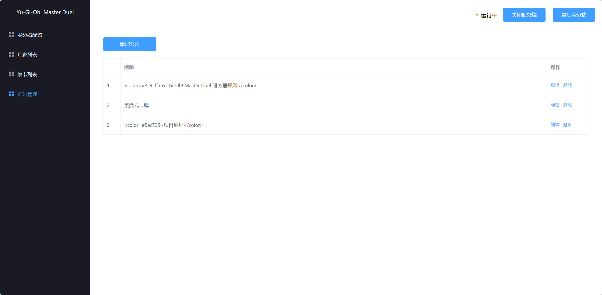

# YgoMasterConsole

基于SpringBoot与Vue的[YgoMaster](https://github.com/pixeltris/YgoMaster)公网联机PVP控制端

### 功能
- 开启/关闭公网PVP对战
- 可视化服务端配置管理
- 玩家牌组、对战回放列表展示
- 服务端公告发布
- 禁卡表编辑/卡牌信息搜索
- ##### 目前公网联机PVP模式下可能会出现较大延迟导致PVP双方无法进行任何操作，请等待[YgoMaster](https://github.com/pixeltris/YgoMaster)作者更新优化

### 部署流程
1. 修改YgoMaster_控制端_SpringBoot项目中的```application.yml```中```filepath```与```exepath```为服务器下的```YgoMaster\Data```与```Ygomaster```路径，如下
```
filepath: "C:\\Users\\Administrator\\Desktop\\YgoMaster\\Data"
exepath: "C:\\Users\\Administrator\\Desktop\\YgoMaster"
```
2. 将YgoMaster_控制端_SpringBoot项目通过Maven进行打包，生成```YgoMaster_Console-1.0.0-SNAPSHOT.jar```文件，并将其放到服务器的YgoMaster目录下使用 ```java -jar YgoMaster_Console-1.0.0-SNAPSHOT.jar```命令运行

3. 修改YgoMaster_管理页面_Vue中的```/src/axios/request.js```,将baseURL设置为```http://你的服务端IP:8080/api/```
4. 打开新的Terminal 依次执行命令
   ```npm install --安装依赖```
   ```npm run serve --运行至本地```
5. 运行本地成功后进入 http://localhost:8081 访问管理页面，将服务端基础IP设置为你的服务器IP后点击页面最下方蓝色保存按钮，并点击右上角重启服务端完成部署。
* ##### 每次修改服务器配置/禁卡列表/公告列表后都需要重启服务端完成修改 


### 联机相关

- 当前客户端配置文件ClientSettings.json中BaseIP与SessionServerIP只能设置为localhost，无法访问其他公网IP与域名下的服务端。可通过在本地进行端口转发实现访问公网IP或域名下的YgoMaster服务端
- Windows端口转发命令(以管理员身份运行)
 ```
 netsh interface portproxy add v4tov4 listenport=BasePort listenaddress=localhost connectport=BasePort connectaddress=目标IP或域名
netsh interface portproxy add v4tov4 listenport=SessionServerPort listenaddress=localhost connectport=SessionServerPort connectaddress=目标IP或域名
 ```
 - Windows取消端口转发命令

 ```
 netsh interface portproxy delete v4tov4 listenport=4989 listenaddress=localhost
netsh interface portproxy delete v4tov4 listenport=4988 listenaddress=localhost
 ```

### 禁卡修改/卡牌查询


### 相关图片
- 服务端基础配置

- 玩家列表

- 禁卡列表

- 卡牌信息查询


- 公告列表

- 游戏主页

- 公告查询

- PVP对战


