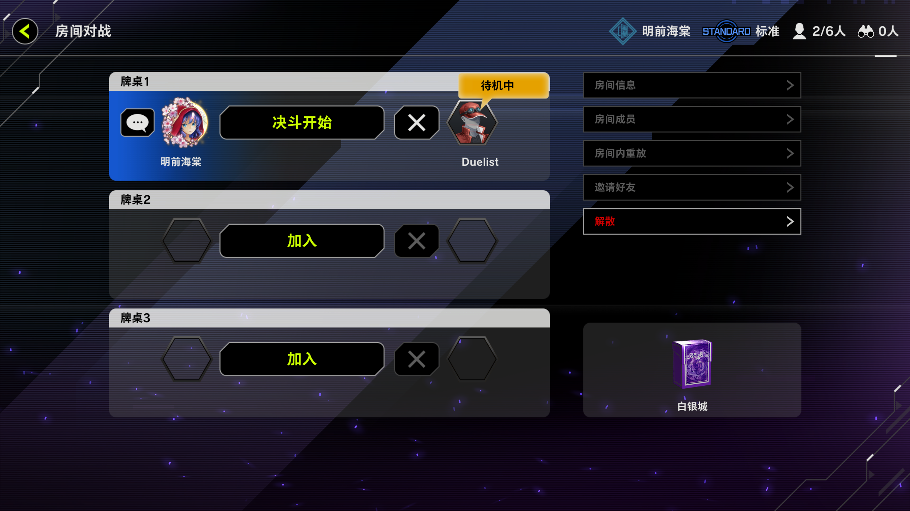
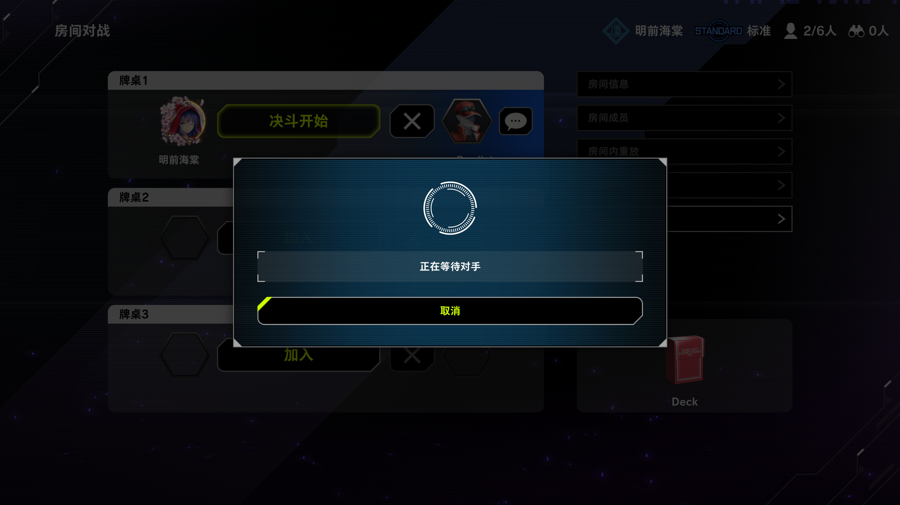

# YgoMasterConsole

#### 基于SpringBoot与Vue的[YgoMaster](https://github.com/pixeltris/YgoMaster)公网联机PVP控制端
#### Thanks to the developers involved in the [YgoMaster](https://github.com/pixeltris/YgoMaster) project for their long-term maintenance

### 功能
- 开启/关闭公网PVP对战
- 可视化服务端配置管理
- 玩家牌组、对战回放列表展示
- 服务端公告发布
- 禁卡表编辑/卡牌信息搜索
- ##### 目前公网联机PVP模式下可能会出现较大延迟导致PVP双方无法进行任何操作，请等待[YgoMaster](https://github.com/pixeltris/YgoMaster)作者更新优化

### 部署流程
1. 修改YgoMaster_控制端_SpringBoot项目中的```application.yml```中```filepath```与```exepath```为服务器下的```YgoMaster\Data```与```Ygomaster```路径，如下
```
filepath: "C:\\Users\\Administrator\\Desktop\\YgoMaster\\Data"
exepath: "C:\\Users\\Administrator\\Desktop\\YgoMaster"
```
2. 将YgoMaster_控制端_SpringBoot项目通过Maven进行打包，生成```YgoMaster_Console-1.0.0-SNAPSHOT.jar```文件，并将其放到服务器的YgoMaster目录下使用 ```java -jar YgoMaster_Console-1.0.0-SNAPSHOT.jar```命令运行

3. 修改YgoMaster_管理页面_Vue中的```/src/axios/request.js```,将baseURL设置为```http://你的服务端IP:8080/api/```
4. 打开新的Terminal 依次执行命令
   ```npm install --安装依赖```
   ```npm run serve --运行至本地```
5. 运行本地成功后进入 http://localhost:8081 访问管理页面，将```服务端基础IP```设置为你的服务器IP后点击页面最下方蓝色保存按钮，并点击右上角重启服务端完成部署。
* ##### 每次修改服务器配置/禁卡列表/公告列表后都需要重启服务端完成修改 


### 联机相关
- 玩家需要修改```YgoMaster/Data/ClientDataClientSettings.json```文件中的```MultiplayerToken```，将其设置为一串随机字符串，```MultiplayerToken```作为每个玩家的身份标识，客户端通过```MultiplayerToken```获取服务端用户的个人信息与牌组/物品信息
- 当前客户端配置文件```ClientSettings.json```中```BaseIP```与```SessionServerIP```只能设置为 ```localhost``` ，无法访问其他公网IP与域名下的服务端。可通过在客户端本地进行端口转发实现访问公网IP或域名下的YgoMaster服务端
- Windows端口转发命令(以管理员身份运行)
 ```
 netsh interface portproxy add v4tov4 listenport=BasePort listenaddress=localhost connectport=BasePort connectaddress=目标IP或域名
netsh interface portproxy add v4tov4 listenport=SessionServerPort listenaddress=localhost connectport=SessionServerPort connectaddress=目标IP或域名
 ```
 - Windows取消端口转发命令

 ```
 netsh interface portproxy delete v4tov4 listenport=4989 listenaddress=localhost
netsh interface portproxy delete v4tov4 listenport=4988 listenaddress=localhost
 ```

### 禁卡修改/卡牌查询
- 禁卡表文件为 ```YgoMaster/Data/Regulation.json```,其中```10**```为默认禁卡表，截止2024-11-12，最新的禁卡表序号为```1028```,管理页面会获取序号大于```1000```小于```2000```的禁卡表为当前默认禁卡表
- 禁卡列表中点击查看按钮，则会通过卡牌ID在[游戏王卡牌数组库](https://db.yugioh-card-cn.com/card_search.action.html)中查询展示对应的卡牌信息，包括卡牌效果、相关卡牌、发售情况等，并可以将其设置为限制、准限制、禁止卡或从禁卡表中移除
- 禁卡列表中点击添加卡牌可以通过卡牌名称或卡牌ID进行搜索，并可以将其设置为限制、准限制、禁止卡
- 禁卡列表中卡牌的名称存在于YgoMaster_管理页面_Vue项目中```/src/cards/```下的```zh_cards.json```与```jp_cards.json```分别为对应的中文卡名与日文卡名，中文卡名存在则显示中文卡名，否则显示日文卡名
- 当游戏王MD的卡牌进度超过JSON文件中的卡牌列表时，禁卡表中的卡牌名称可能为空，需手动更新```zh_cards.json```与```jp_cards.json```
- 部分异画卡牌名称可能为空，需手动添加ID与名称至```zh_cards.json```与```jp_cards.json```
### 公告设置

公告设置页面可发布游戏内公告，包括滚动窗标题、小标题与正文，游戏中公告文本使用富文本展示，可通过设置富文本标签来修改包括字号```<size=25>```字体颜色```<color=#3c9cff>```行距```<indent=5%>```等内容,如下图所示
- 公告编辑


### 相关图片
- 服务端基础配置

- 玩家列表

- 禁卡列表

- 卡牌信息查询


- 游戏主页

- PVP对战






